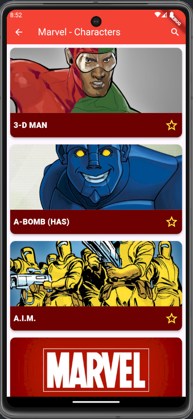
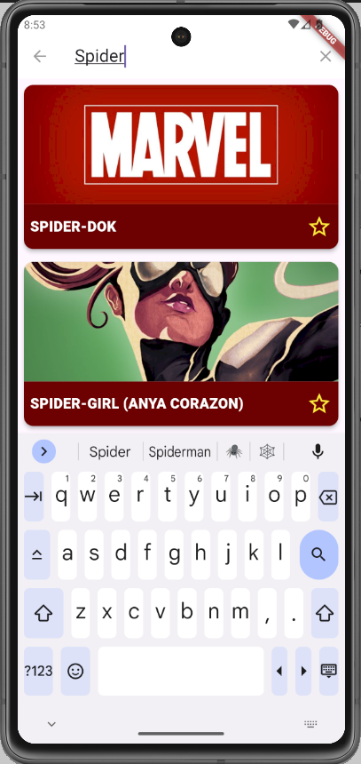
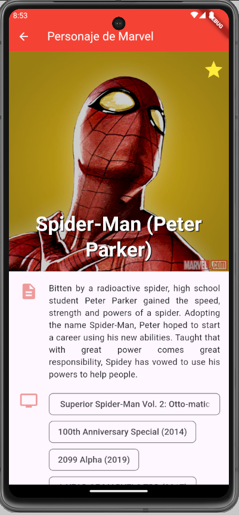
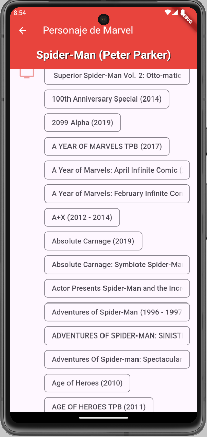
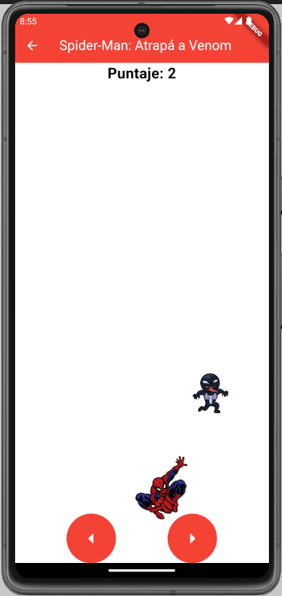

## 3 Documentacion de la API de Marvel - Chaparro Juan Jose Leg. 21737

API URL Utilizadas:

Para la lista, paginado y búsqueda: "https://tup-labo-4-grupo-15.onrender.com/api/v1/marvel/chars?nameStartsWith=$query&limit=$_limit&offset=$offset";

Para mostrar los detalles de cada personaje: "https://tup-labo-4-grupo-15.onrender.com/api/v1/marvel/chars/${character.id}"

En esta parte de la aplicacion se muestra una lista de personajes de marvel, se puede buscar por nombre, y se puede ver los detalles de cada personaje.

### 1. Detalles Técnicos.

• Emulador Usado: Pixel 7 API 33, resolución 1080x2400.
• Persistencia de Datos: SharedPreferences para almacenar preferencias como tema oscuro y personajes favoritos.
• Gestión de Estado: Provider para cambiar entre tema claro y oscuro.
• Peticiones HTTP: Uso de FutureBuilder para gestionar solicitudes a la API.
• Font personalizada: "assets/fonts/Marvel.ttf" extraida de la pagina https://www.dafont.com/es/marvel.font.

### 2. Lista de Personajes.

Descripción:

      •	Lista de personajes de Marvel con su imagen, nombre y estrella que marca favoritos, cada item que se carga proviene de una card rehutilizable "CustomCardMarvelChars.dart".

      •	Sistema de búsqueda utilizando SearchDelegate, que optimiza las consultas a la API mediante un temporizador.

### 3. Detalle del Personaje.

Descripción:

      •	Pantalla que muestra la descripcion del personaje:
         o	Nombre y estrella para agregar o quitar de favoritos.
         o	Imagen.
         o	Descripcion.
         o	Series en las que aparece.

      •	Para que el nombre me quede en la parte superior utilize un SilverAppBar, y para que el resto de la informacion quede debajo de la barra de navegacion utilice un SingleChildListDelegate.

### 4. Mini-Juego: Spider-Man: Atrapa a Venom!.

Descripción: Moverse de un lado al otro atrapando a Venom.

### 5. Widgets Reutilizables utilizados:

a. CustomCardMarvelChars.

b. DrawerMenu.

c. FutureFetcher.